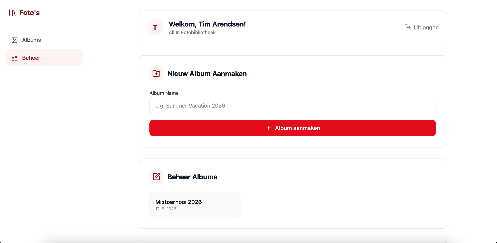
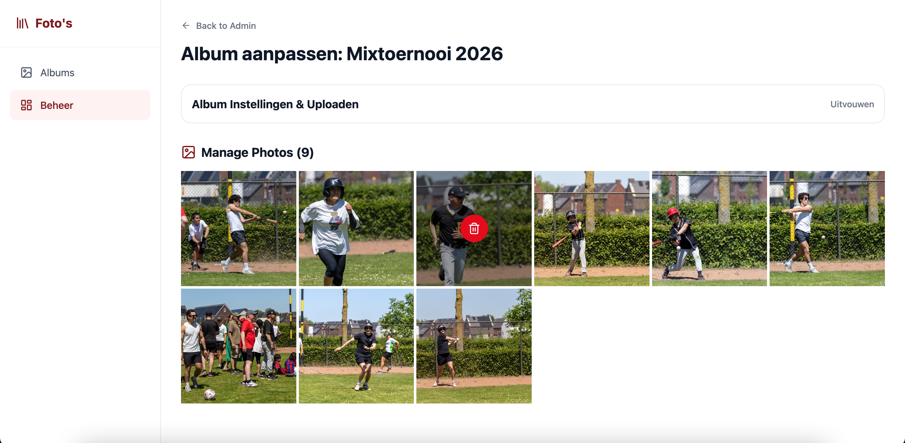

# CLOI 🎞 Central Library of Images

This repository can be used to host a photo gallery for sports associations, groups of friends, or any other group of
people that may want to host images centrally on their own server.


Pictures are grouped in albums, where each album is an event that started on a specific date. Albums are sorted by date
on the home page, and users can select an album to view.

## Features

- Self-hosted using Docker
- Possibility to password-protect albums
- EXIF metadata extraction
- Thumbnail generation for fast image viewing
- One central library, not multiple libraries for different users

## Setting up

The project consists of two files, a `./server` folder, and a `./client` folder. The server folder consists of a Node.js
Express server that serves as the back-end, while the frontend is built in React using Vite. Images are stored on the
server the back-end is placed on, in a folder named after the album the picture is uploaded in. The project has a
`docker-compose.yml`, and each project has its own `Dockerfile`. Both the `server` and `client` folder need their own
`.env` file, filled with the values below.

```
# server/.env

SERVER_URL=https://123.com
CLIENT_URL=https://123.com
SERVER_PORT=3001
SESSION_SECRET=a-very-secret-key-for-this-project
OIDC_ISSUER=https://login.microsoftonline.com/[TENANT]/v2.0
OIDC_CLIENT_ID="XXX"
OIDC_CLIENT_SECRET="XXX"
DB_PATH="/data/photos.db"
UPLOADS_PATH="/data/uploads"

# client/.env

VITE_CLIENT_PORT=5173
VITE_CLIENT_URL=https://123.com
VITE_SERVER_URL=https://123.com
```

## Authentication

Right now, the application only supports authentication through OpenID Connect, which means users can log in using their
Microsoft 365 account linked to their organization, a Google login, GitHub, or any other social login.

Once authenticated, users can create and edit albums.
Albums can optionally be protected with an album password from the admin edit page; visitors then need to provide that password (also supported via `?pass=...` in the album URL).



